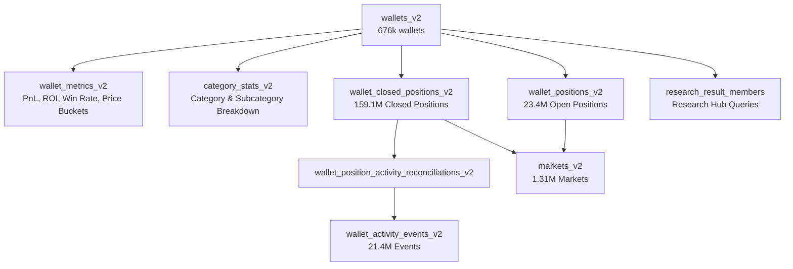
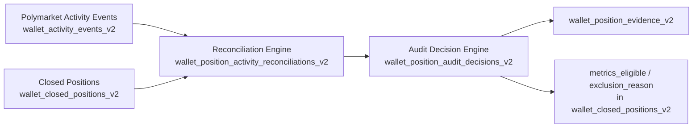

# Polymarket Intelligence Database Overview & 10 Wallet Profiles

This document details the PostgreSQL database architecture, schema definitions, table volumes, and presents an end-to-end examination of **10 real wallet profiles** queried directly from our production database (`poly_db`).

---

## 1. Database Architecture & High-Level Metrics

- **Engine**: PostgreSQL 16 (running via Docker container `poly-postgres-1`)
- **Primary Schema**: `public`
- **Total Tables**: 48 relational tables
- **Total Position History**: Over **159 Million** historical closed positions
- **Tracked Wallets**: **676,002** total wallets
- **Computed Metrics**: **613,511** wallet metric records
- **Total Markets Tracked**: **1,310,896** Polymarket prediction markets

### Table Volume Sizing (Live Database Counts)

| Schema | Table Name | Approx. Row Count | Functional Domain |
| :--- | :--- | :--- | :--- |
| `public` | `wallet_closed_positions_v2` | **159,146,473** | Historical trade & position resolution records |
| `public` | `wallet_activity_exception_events_v2` | **25,936,698** | Activity pipeline exception & error events |
| `public` | `wallet_positions_v2` | **23,417,977** | Open wallet positions & unrealized PnL |
| `public` | `wallet_activity_events_v2` | **21,385,861** | Raw on-chain / API activity transaction log |
| `public` | `wallet_market_activity_v2` | **6,622,903** | Aggregated market-level wallet actions |
| `public` | `category_stats_v2` | **4,952,535** | Subcategory & category performance stats |
| `public` | `wallet_position_audit_decisions_v2`| **2,740,513** | Reconciliation audit decisions & heuristics |
| `public` | `wallet_position_activity_reconciliations_v2` | **2,713,481** | Merged on-chain and CLOB trade reconstructions |
| `public` | `wallet_position_evidence_v2` | **1,891,394** | Position balance & transfer verification evidence |
| `public` | `markets_v2` | **1,310,896** | Prediction market definitions & outcomes |
| `public` | `wallets_v2` | **676,002** | Master wallet directory & classification tier |
| `public` | `wallet_metrics_v2` | **613,511** | Core wallet PnL, volume, ROI & price buckets |
| `public` | `wallet_activity_only_markets_v2` | **177,840** | Markets flagged with activity-only records |
| `public` | `wallet_source_snapshots_v2` | **886** | Snapshot states from external data syncs |
| `public` | `wallet_activity_scan_state_v2` | **710** | Activity backfill & cursor tracking |
| `public` | `research_result_members` | **100** | Research hub query wallet memberships |
| `public` | `users` | **50** | Platform authenticated users |
| `public` | `research_chats` & `messages` | **6** | Research panel conversational records |
| `public` | `data_api_rate_limit_buckets` | **3** | Polymarket Data API rate limiter buckets |
| `public` | `research_runs` & `result_sets` | **4** | Saved research execution runs |

---

## 2. Core Functional Subsystems



### Wallet Tier Breakdown (`wallets_v2.tier`)

Our classification engine continuously classifies all 676,002 wallets into distinct tiers:
- **`LOW_BALANCE`**: **407,985** (Inactive or sub-threshold balances)
- **`STANDARD`**: **9,491** (Active retail/standard participants)
- **`CURATED`**: **7,343** (Verified high-performing smart money / alpha traders)
- **`NEW`**: **1,772** (Recently detected wallets undergoing initial screening)
- **`PREVIOUSLY_CURATED`**: **1,624** (Past curated wallets currently under review)

---

## 3. Database Schema Reference

### `wallets_v2`
The master registry table for all addresses:
```sql
CREATE TABLE public.wallets_v2 (
    address                     VARCHAR(42) PRIMARY KEY,
    username                    VARCHAR(255),
    tier                        VARCHAR(20) NOT NULL DEFAULT 'UNCLASSIFIED',
    tier_reason                 VARCHAR(50),
    is_dormant                  BOOLEAN DEFAULT FALSE,
    last_trade_at               TIMESTAMPTZ,
    added_at                    TIMESTAMPTZ DEFAULT now(),
    updated_at                  TIMESTAMPTZ DEFAULT now(),
    next_check_at               TIMESTAMPTZ,
    curated_at                  TIMESTAMPTZ,
    last_trade_swept_at         TIMESTAMPTZ,
    funding_source              VARCHAR(30) DEFAULT 'cex_deposit',
    funded_by                   VARCHAR(42),
    transferred_positions_count INTEGER DEFAULT 0
);
```

### `wallet_metrics_v2`
Comprehensive calculated performance metrics across all traded markets:
- **Financials**: `total_pnl`, `total_volume`, `roi_pct`, `win_rate`, `resolved_count`, `winning_count`
- **Portfolio**: `balance`, `position_value`, `deposits`, `withdrawals`, `peak_capital`
- **Polymarket Official Sync**: `pm_pnl`, `pm_volume`, `pm_rank`, `pm_synced_at`
- **Price/Odds Buckets**: Buy, win, and loss distributions across 6 odds brackets:
  - `<15¢`, `15¢–30¢`, `30¢–45¢`, `45¢–60¢`, `60¢–75¢`, `>75¢`
- **Parlay Metrics**: `parlay_pnl`, `parlay_volume`, `parlay_win_rate`

---

## 4. Position Audit & Activity Reconciliation Architecture

To solve historical trade/PnL discrepancy and detect phantom or misattributed positions, our system reconciles snapshot positions against raw Polymarket activity events.



### The Position & Audit Columns Breakdown

#### 1. Audit Columns in `wallet_closed_positions_v2`
These columns govern whether a position is factored into leaderboard metrics:
| Column Name | Type | Description |
| :--- | :--- | :--- |
| `metrics_eligible` | `BOOLEAN` | If `false`, this position is excluded from official wallet PnL/ROI calculations. (Default: `true`). |
| `exclusion_reason` | `TEXT` | Human/audit reason why position was excluded (e.g. `unverified_transfer`, `phantom_signature`). |
| `excluded_at` | `TIMESTAMPTZ` | Timestamp when the audit excluded the position. |
| `data_quality_flag`| `TEXT` | Integrity flag describing discrepancy severity. |
| `source_asset` | `TEXT` | Raw underlying asset token ID from source API. |
| `asset_token_id` | `NUMERIC` | Standardized ERC1155 token identifier. |
| `is_redeemable` | `BOOLEAN` | Marks if the position represents an unredeemed winning share. |

#### 2. Position Reconciliation Table (`wallet_position_activity_reconciliations_v2`)
Stores the mathematical diff between database position accounting and raw on-chain/API activity:
| Column Group | Columns | Purpose |
| :--- | :--- | :--- |
| **Audit Identity** | `audit_id`, `snapshot_id`, `address`, `condition_id`, `outcome` | Unique reconciliation record per position outcome. |
| **DB Position Side**| `db_total_bought`, `db_avg_buy_price`, `db_cost_basis`, `db_realized_pnl` | Historical position ledger values before reconciliation. |
| **Activity Buy Side**| `activity_buy_shares`, `activity_buy_usdc`, `activity_avg_buy_price` | Reconstructed from `wallet_activity_events_v2` where `side='BUY'`. |
| **Delta Math** | `shares_delta`, `cost_basis_delta` | Precise numerical gap (`activity_buy_shares - db_total_bought`). |
| **Lifecycle Events**| `activity_sell_shares`, `activity_sell_usdc`, `activity_avg_sell_price`, `activity_redeem_shares`, `activity_redeem_usdc` | Reconstructed sells and redemptions. |
| **Non-Trade Ops** | `activity_split_shares`, `activity_merge_shares`, `activity_conversion_shares`, `activity_reward_usdc`, `activity_rebate_usdc`, `activity_yield_usdc` | Captures splits, merges, conversions, and liquidity rewards. |
| **Lineage & Transfers** | `lineage_transfer_in_shares`, `lineage_transfer_in_count`, `lineage_first_transfer_at` | Tracks whether shares were acquired via wallet-to-wallet transfer. |
| **Evaluation State**| `classification`, `comparison_quality`, `acquisition_status`, `position_recommendation` | Machine classifications governing audit verdict. |

#### 3. Classification & Decision States

| Column | Actual DB Values | Meaning |
| :--- | :--- | :--- |
| **`classification`** | `direct_activity_buy` | Trade was directly found in the activity log. |
| | `activity_outcome_differs` | Market activity exists, but outcome name differs (e.g. Yes/No vs Named team). |
| | `activity_same_leg_nontrade` | Leg exists via split, merge, or conversion rather than standard buy. |
| | `activity_absent` | No activity event was found for this condition ID in the scan. |
| **`comparison_quality`**| `exact_activity_buy` | `shares_delta` is ~0 and cost basis matches within precision. |
| | `activity_buy_values_differ` | Activity buy events exist but volume or price differs slightly. |
| | `outcome_mismatch` | Outcome naming divergence between CLOB and Gamma. |
| | `nontrade_no_buy` | Acquired through non-buy on-chain actions. |
| **`position_recommendation`**| `eligible` | Safe to include in wallet metrics calculation. |
| | `review_required` | Requires lineage or manual review before inclusion. |
| **`audit_status`** | `eligible`, `review_required`, `excluded_proven` | Stored in `wallet_position_audit_decisions_v2`. |

---

### Real Database Audit & Reconciliation Examples

#### Case A: Verified Direct Buy (`exact_activity_buy` & `eligible`)
Position matches raw activity events to 8 decimal places:
```
Address: 0xf49ce459b52f60b70ce0fe9aa6203e6bf90f9786
Condition ID: 0x5596571a567d78247ce9dcd57bed416d7701e84724da44ebb9a5c415c8c22099
Outcome: Yes

[DB Position Ledger]
  total_bought: 14,999.6932 shares
  cost_basis:   $1,499.9693
  avg_price:    $0.1000

[Reconciled Activity Events (57 Events)]
  activity_buy_shares: 14,999.6933 shares
  activity_buy_usdc:   $1,499.9693
  shares_delta:        -0.00008 shares (Floating point rounding)
  cost_basis_delta:    -$0.000008

[Verdict]
  classification:          direct_activity_buy
  comparison_quality:      exact_activity_buy
  acquisition_status:      verified_buy
  position_recommendation: eligible
  audit_status:            eligible
  audit_reason:            direct_activity_buy
```

#### Case B: Outcome Mismatch Divergence (`outcome_mismatch` & `review_required`)
The database position recorded outcome `"Yes"`, but raw activity events are recorded for named teams (`"Phoenix Mercury"`):
```
Address: 0xf49ce459b52f60b70ce0fe9aa6203e6bf90f9786
Condition ID: 0x41b5a0166f3201dab772d08b157f271fe268334193b3d5fd60ff3d8e2943bd2b
Outcome: Yes

[DB Position Ledger]
  total_bought: 1,962.8272 shares
  cost_basis:   $1,452.4921
  outcome:      "Yes"

[Activity Events (51 Events)]
  activity_outcomes:   ["Phoenix Mercury"]
  activity_buy_shares: 1,962.8273 shares
  activity_buy_usdc:   $510.3351

[Verdict]
  classification:          activity_outcome_differs
  comparison_quality:      outcome_mismatch
  acquisition_status:      unknown
  position_recommendation: review_required
  audit_status:            review_required
  audit_reason:            activity_outcome_differs
```

#### Case C: Same-Leg Non-Trade / Splits (`nontrade_no_buy`)
Position shares exist in the portfolio, but activity logs show no direct BUY order—instead obtained via token split or mint:
```
Address: 0xf49ce459b52f60b70ce0fe9aa6203e6bf90f9786
Condition ID: 0x5b02c9d2dc0095a784306fbca9f83d1a5454359560d22192b030be61152c85e4
Outcome: No

[DB Position Ledger]
  total_bought: 100,000 shares
  cost_basis:   $99,900.00

[Activity Events]
  activity_buy_shares: 0
  activity_buy_usdc:   $0
  event_type:          SPLIT / MINT

[Verdict]
  classification:          activity_same_leg_nontrade
  comparison_quality:      nontrade_no_buy
  acquisition_status:      unknown
  position_recommendation: review_required
  audit_status:            eligible (or review_required depending on split evidence)
```

---

## 5. 10 Wallet Profiles Overview

Here are 10 real curated wallets from the database showing their usernames, tiers, calculated PnL, official Polymarket rank/PnL, volumes, and win rates:

| # | Username | Address | Tier | Calculated PnL | PM PnL | PM Rank | Total Volume | Win Rate | Resolved | Balance | Open Value |
| - | :--- | :--- | :--- | :--- | :--- | :--- | :--- | :--- | :--- | :--- | :--- |
| **1** | **swisstony** | `0x204f72f35326db932158cba6adff0b9a1da95e14` | CURATED | **+$30,779,367** | +$23,631,665 | #1 | $505,528,974 | 53.06% | 89,158 | $88,086 | $29,932 |
| **2** | **ferrariChampions2026** | `0xfe787d2da716d60e8acff57fb87eb13cd4d10319` | CURATED | **+$26,051,730** | +$2,211,258 | #69 | $374,752,865 | 56.15% | 64,121 | $145,451 | $145,340 |
| **3** | **Cannae** | `0x7ea571c40408f340c1c8fc8eaacebab53c1bde7b` | CURATED | **+$13,388,565** | +$1,416,978 | #126 | $53,382,108 | 57.28% | 47,306 | $58,761 | $47,614 |
| **4** | **Bonereaper** | `0xeebde7a0e019a63e6b476eb425505b7b3e6eba30` | CURATED | **+$9,474,190** | +$1,365,725 | #131 | $67,485,208 | 51.18% | 111,842 | $0 | $11,245 |
| **5** | **std0** | `0xdf7930e89a2c47560165331863c31deca0733dcd` | CURATED | **+$6,421,404** | +$184,089 | #1,163 | $1,282,325 | **90.76%** | 5,608 | $467 | $0 |
| **6** | **Lilybaeum** | `0x01c78f8873c0c86d6b6b92ff627e3802237ee995` | CURATED | **+$6,039,268** | +$995,554 | #185 | $34,895,895 | 54.87% | 38,664 | $0 | $2,956 |
| **7** | **hd777** | `0x986b121c40e715167dde178b8520bf132a57bdc6` | CURATED | **+$3,924,031** | -$436,171 | #3,113,721 | $55,858,260 | **78.25%** | 39,904 | $3,979 | $0 |
| **8** | **ic4cream** | `0x27f738fe203827445690339104aae35b20bc44b0` | CURATED | **+$3,865,254** | +$386,288 | #559 | $15,194,389 | 65.08% | 4,061 | $0 | $14,707 |
| **9** | **snoopdoge** | `0x38e598961dd0456a7fb2e758bd433d3e59fb8a4a` | CURATED | **+$3,626,927** | +$70,693 | #2,718 | $13,738,290 | 51.75% | 84,541 | $0 | $30 |
| **10** | **0xb55fa1296...** | `0xb55fa1296e6ec55d0ce53d93b9237389f11764d4` | CURATED | **+$2,820,420** | +$1,027,939 | #177 | $34,870,379 | 49.34% | 116,055 | $8,366 | $16,846 |

---

## 6. Detailed Breakdown of Each Wallet

### 1. `swisstony` (`0x204f72f35326db932158cba6adff0b9a1da95e14`)
> **The #1 Ranked Polymarket Giant**
- **Classification**: `CURATED` (Funding Source: `inherited_positions` via `0xe11118...`)
- **Financial Profile**:
  - **Calculated Total PnL**: **+$30,779,366.69** (ROI: `6.09%`)
  - **Polymarket Sync**: Rank **#1**, PM PnL: **+$23,631,664.55**, PM Volume: **$1.85B**
  - **Trade Count**: 89,158 resolved positions (47,307 wins, 53.06% win rate)
  - **Portfolio**: Cash Balance: `$88,086.25`, Open Position Value: `$29,931.75`
- **Odds / Price Bucket Breakdown**:
  - `<15¢`: 10,693 trades (14.0% win rate)
  - `15¢–30¢`: 9,439 trades (20.4% win rate)
  - `30¢–45¢`: 9,929 trades (37.0% win rate)
  - `45¢–60¢`: 13,570 trades (48.6% win rate)
  - `60¢–75¢`: 12,932 trades (61.0% win rate)
  - `>75¢`: 32,595 trades (79.0% win rate)
- **Top Categories**:
  - **SPORTS (Overall)**: +$31.48M PnL on $496.7M volume (52.3% win rate across 71,041 markets)
  - **SPORTS / Soccer**: +$12.35M PnL on $62.2M volume (51.1% win rate across 23,365 markets)

---

### 2. `ferrariChampions2026` (`0xfe787d2da716d60e8acff57fb87eb13cd4d10319`)
> **High-Volume Sports & Esports Specialist**
- **Classification**: `CURATED`
- **Financial Profile**:
  - **Calculated Total PnL**: **+$26,051,730.13** (ROI: `6.95%`)
  - **Polymarket Sync**: Rank **#69**, PM PnL: **+$2,211,257.82**, PM Volume: **$997.2M**
  - **Trade Count**: 64,121 resolved positions (36,006 wins, 56.15% win rate)
  - **Portfolio**: Cash Balance: `$145,451.31`, Open Position Value: `$145,339.91`
- **Odds / Price Bucket Breakdown**:
  - Heavy concentration in `45¢–60¢` (18,755 trades, 58.9% win rate) and `60¢–75¢` (13,526 trades, 55.5% win rate)
- **Top Categories**:
  - **Baseball**: +$325,447 PnL on $97.6M volume (16,296 markets)
  - **Tennis**: $91.2M volume
  - **ESPORTS**: $76.3M volume

---

### 3. `Cannae` (`0x7ea571c40408f340c1c8fc8eaacebab53c1bde7b`)
> **Soccer & Sports Prediction Alpha Engine**
- **Classification**: `CURATED`
- **Financial Profile**:
  - **Calculated Total PnL**: **+$13,388,564.75** (ROI: **`25.08%`**)
  - **Polymarket Sync**: Rank **#126**, PM PnL: **+$1,416,978.01**
  - **Trade Count**: 47,306 resolved positions (27,096 wins, 57.28% win rate)
  - **Portfolio**: Cash Balance: `$58,761.14`, Open Position Value: `$47,614.39`
- **Top Categories**:
  - **SPORTS**: +$13.10M PnL on $50.6M volume (57.5% win rate)
  - **Soccer**: +$5.32M PnL on $14.9M volume (57.1% win rate, **35.7% ROI**)

---

### 4. `Bonereaper` (`0xeebde7a0e019a63e6b476eb425505b7b3e6eba30`)
> **High-Frequency Crypto/Bitcoin Micro-Market Trader**
- **Classification**: `CURATED`
- **Financial Profile**:
  - **Calculated Total PnL**: **+$9,474,189.69** (ROI: `14.04%`)
  - **Polymarket Sync**: Rank **#131**, PM PnL: **+$1,365,724.94**
  - **Trade Count**: 111,842 resolved positions (57,239 wins, 51.18% win rate)
  - **Portfolio**: Open Position Value: `$11,245.25`
- **Top Categories**:
  - **CRYPTO / Bitcoin**: +$9.48M PnL on $59.0M volume (52.8% win rate across 55,777 markets)
  - **Ethereum**: 29,006 markets traded

---

### 5. `std0` (`0xdf7930e89a2c47560165331863c31deca0733dcd`)
> **Extreme Precision Sniping (90.76% Win Rate, 500.7% ROI)**
- **Classification**: `CURATED` (Reason: `re-qualified: previously curated`)
- **Financial Profile**:
  - **Calculated Total PnL**: **+$6,421,403.77** on only **$1,282,325.19** total volume!
  - **ROI**: **`500.76%`**
  - **Win Rate**: **`90.76%`** (5,090 wins out of 5,608 trades)
  - **Odds Specialization**: Out of 5,608 trades, **5,330** were placed in the `45¢–60¢` price bucket with a staggering **91.86% win rate** (4,896 wins / 434 losses).
- **Top Categories**:
  - **CRYPTO / Bitcoin**: +$6.40M PnL on $1.27M volume (92.5% win rate across 5,345 markets)

---

### 6. `Lilybaeum` (`0x01c78f8873c0c86d6b6b92ff627e3802237ee995`)
> **Tennis & Sports Swing Alpha**
- **Classification**: `CURATED` (Reason: `auto: roi/pnl threshold`)
- **Financial Profile**:
  - **Calculated Total PnL**: **+$6,039,267.64** (ROI: `17.31%`)
  - **Polymarket Sync**: Rank **#185**, PM PnL: **+$995,554.31**
  - **Trade Count**: 38,664 resolved positions (21,215 wins, 54.87% win rate)
- **Top Categories**:
  - **Soccer**: +$647,346 PnL on $11.0M volume (9,422 markets)
  - Active positions in US Open Tennis (Tatjana Maria, Thanasi Kokkinakis)

---

### 7. `hd777` (`0x986b121c40e715167dde178b8520bf132a57bdc6`)
> **High-Probability Long-Tail Accumulator (78.25% Win Rate)**
- **Classification**: `CURATED` (Reason: `auto: win_rate >= 70%`)
- **Financial Profile**:
  - **Calculated Total PnL**: **+$3,924,030.58** (ROI: `7.02%`)
  - **Win Rate**: **`78.25%`** (31,225 wins / 39,904 trades)
  - **Execution Style**: Concentrated in high-probability odds brackets:
    - `60¢–75¢`: 9,893 trades (87.8% win rate)
    - `>75¢`: 22,272 trades (**97.0% win rate** — 21,614 wins to 658 losses)
- **Top Categories**:
  - **CRYPTO / Bitcoin**: +$2.81M PnL on $24.6M volume (14,421 markets)

---

### 8. `ic4cream` (`0x27f738fe203827445690339104aae35b20bc44b0`)
> **High Conviction Sports Punter (25.44% ROI)**
- **Classification**: `CURATED` (Reason: `auto: pnl >= $10k`)
- **Financial Profile**:
  - **Calculated Total PnL**: **+$3,865,254.26** (ROI: `25.44%`)
  - **Polymarket Sync**: Rank **#559**, PM PnL: **+$386,288.42**
  - **Trade Count**: 4,061 resolved positions (2,643 wins, 65.08% win rate)
  - **Portfolio**: Open Position Value: `$14,706.62`
- **Active Open Positions**:
  - Detroit Tigers (Size: 11,932 shares, Avg Price: $0.50, Value: $5,608)
  - Cruz Hewitt (Size: 6,178 shares, Avg Price: $0.163, Value: $3,089, Unrealized PnL: +$2,079)

---

### 9. `snoopdoge` (`0x38e598961dd0456a7fb2e758bd433d3e59fb8a4a`)
> **Multi-Chain Rapid-Resolution Scalper**
- **Classification**: `CURATED` (Reason: `auto: pnl>10k AND (roi>30% OR win_rate>70%)`)
- **Financial Profile**:
  - **Calculated Total PnL**: **+$3,626,927.40** (ROI: `26.40%`)
  - **Polymarket Sync**: Rank **#2,718**, PM PnL: **+$70,692.99**
  - **Trade Count**: 84,541 resolved positions (43,750 wins, 51.75% win rate)
- **Top Categories**:
  - **Bitcoin**: +$3.47M PnL on $11.3M volume (59.1% win rate across 19,209 markets)
  - **Ethereum**: 20,026 markets
  - **Solana**: 19,204 markets

---

### 10. `0xb55fa1296...` (`0xb55fa1296e6ec55d0ce53d93b9237389f11764d4`)
> **Mega-Scale Crypto Automation (116k Resolved Markets)**
- **Classification**: `CURATED`
- **Financial Profile**:
  - **Calculated Total PnL**: **+$2,820,420.39** (ROI: `8.09%`)
  - **Polymarket Sync**: Rank **#177**, PM PnL: **+$1,027,938.91**
  - **Trade Count**: **116,055** resolved positions (57,262 wins)
  - **Portfolio**: Cash Balance: `$8,365.52`, Open Position Value: `$16,846.07`
- **Top Categories**:
  - **Bitcoin**: +$2.53M PnL on $23.4M volume (34,250 markets)
  - **Ethereum**: +$311,887 PnL on $6.2M volume (25,807 markets)
  - **Solana**: 21,247 markets

---

## 7. Key Takeaways & DB Characteristics

1. **Volume & Granularity**:
   The database manages high-throughput, tick-by-tick prediction market data, storing **159M+ closed positions** and **21M+ activity events**.
2. **Reconciliation & PnL Integrity**:
   Calculated PnL (`total_pnl`) captures full portfolio accounting, while `pm_pnl` and `pm_rank` reflect Polymarket's public API reports, enabling divergence tracking and forensic auditing.
3. **Diverse Trading Archetypes in Data**:
   The dataset accurately categorizes diverse trading strategies:
   - **Market Makers / HFT**: e.g., `Bonereaper` and `0xb55fa1296...` executing 110k+ micro-bets.
   - **Sniper Whales**: e.g., `std0` achieving 90.76% win rate and 500% ROI.
   - **Sports Handlers**: e.g., `swisstony` and `Cannae` processing tens of millions in sports volume.
